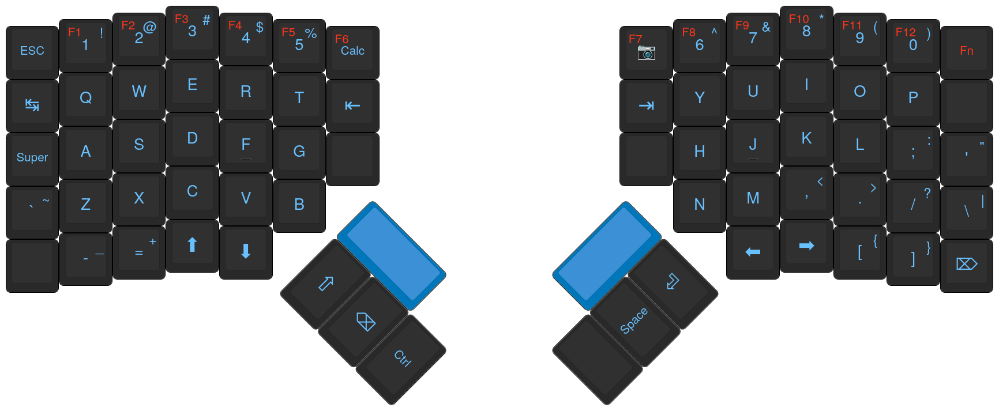
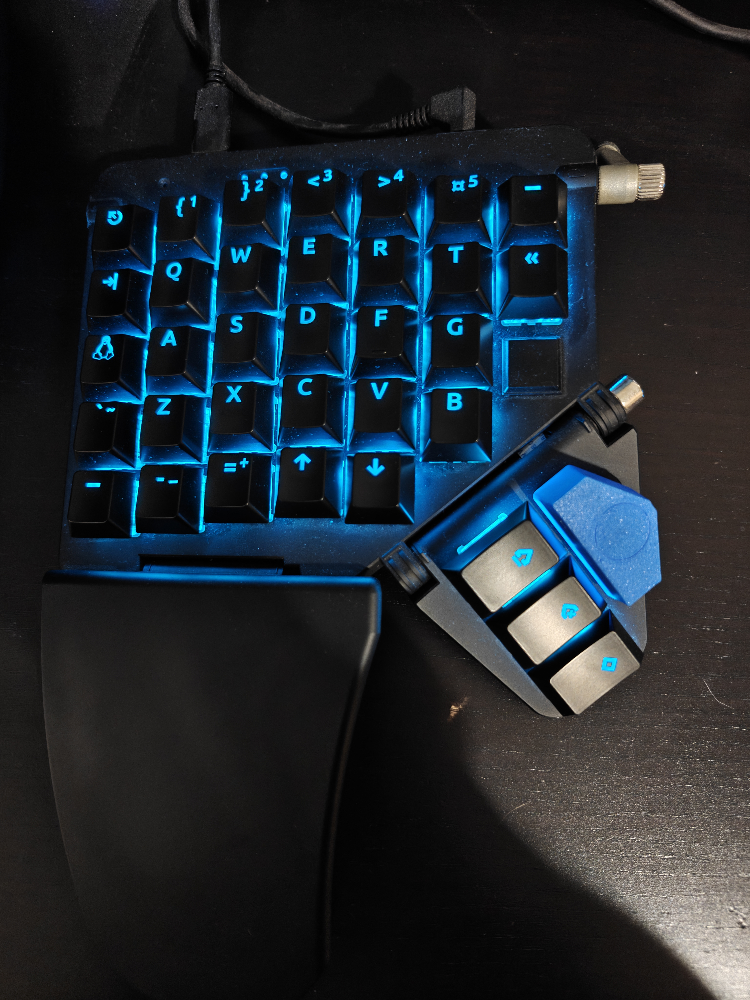
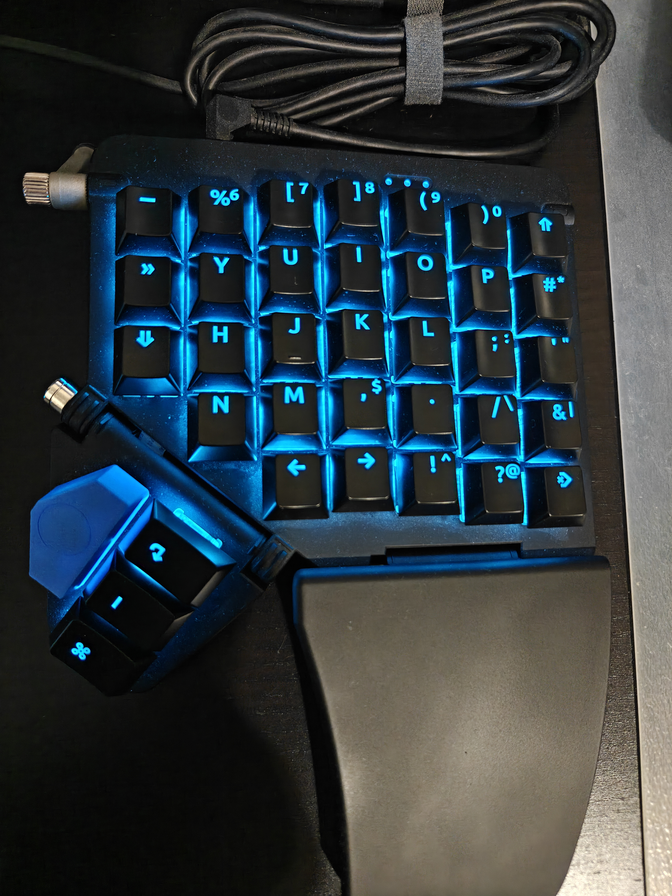

# My fork of ZSA's fork of QMK Firmware

My current Moonlander Mk1 config. This repo functions as a submodule to my own fork of qmk-firmware, which has very few changes itself ([inferno214221/qmk-firmware](https://github.com/inferno214221/qmk-firmware)).

Features include:

- A personalized layout (obviously).
- Tetris mode.
- Various 8-bit songs and sound effects.
- Minor fixes to ZSA's fork (lmao).
- Custom animations with matrix screensaver (or key-saver I guess).
- Eager tapdance behaviour.
- A unicode leader key ([see unicode_leader.c](./unicode_leader.c)).
- Trial key overrides for programming, inspired by DVORAK programmer:

## Layout

_As opposed to this semi-default keymap, which I derive from the keyboard's shape itself:_

## Photos

They do look a bit dusty, but here are photos my current setup:

|  |  |
|-|-|

I recently got new keycaps to match the layout defined in this repo, along with the 3D-printed blue _launch keys_ that a friend made.

## Layout Reasoning

- Brackets paired across the top for optimal use programming, numbers are used less commonly.
- `(` and `)` stay in the same place, with `{` and `}` as the second most popular in a mirrored position.
- `<` and `>` are next most common, so they go to the right of braces, on the opposite side to `/` and `'`. `-` and `=` remain on the same side, although seemingly without causing problems for various arrows.
- This leaves `[` and `]` on the right. Next to `(` and `)` for markdown links, close to both `#` and `&` for attributes and slicing, although `!` is a little annoying for interior attributes or function-like proc macro invocation.
- `5` and `6` are among the worst keys on terms of reachability, so percent goes on the number `6` and `5` remains without a substitute.
- `` ` `` and `~` sit below super, tab and escape, as I've always had with split keyboards, putting it in a good spot for the left pinky when writing markdown, doc comments and JS strings.
- `-` and `+` stay next to each other, although on the bottom left of the keyboard. Again, this is something I've had for quite a while. Arrows and assignment operators remain easy to perform. CONSTANT_CASE becomes a little annoying.
- To avoid misinputs while typing numbers, full caps or similar, `.` is adjusted to have its own key, in the normal position. `,` remains next to it, although paired with `$`, which is commonly used while shifted. Using `,` with shift is occasionally a little annoying, especially for lists of numbers.
- Diagonally down to the right and also shifted is the `^`, forming a pair of regex anchors. `^` also represent bitwise XOR, linking it to the un-shifted variant, `!`, acting as logical NOT.
- The `!` and the adjacent `?` all sit adjacent to `.`, collectively representing the different ways to end a sentence.
- `?` is paired with the `@`, another one of the least used characters, and one that definitely deserves to be shifted.
- `;`, `:`, `'` and `"` remain in the same position, frequently used in programming and English. I tried swapping the two quote characters around but found it frustrating for contractions and lifetimes.
- Underneath these and adjacent to `.`, sits `/`, paired with `\` when shifted. This position is helpful for paths with `./` and `../` both being common occurrences. Escapes are usually fine, although I sometimes accidentally input a `|` instead, which might still be out of habit. Typing many commands in LaTeX is a bit frustrating, but I blame the language itself. I prefer Typst where possible.
- To the right sits `&` and `|`, pairing boolean AND and OR, often both repeated.
- `&` is in a prime position for borrowing and informal typing.
- Lastly, `#` sits two keys above, paired with `*`. I tried these two the other way around for a while, but settled on this instead. Both are common within markup. `&` is also close for paired usage with pointers. The adjacency to `:` is helpful for glob imports (`::*;`), with shift being dropped after the third key.
- `_`, `*` and `~` all hold shifted positions, which is seem reasonable when applying markdown emphasis.
- The shifted behaviour for number keys is defined so that the key literal is the number, but the combination consisting of no modifiers overrides to the corresponding symbol and shift alone is ignored. This maintains number-based shortcuts.

Pain points and room for improvement:

- Writing (embedded) LaTeX requires tonnes of hand movement and heaps of shifting for `\` and `$`. I don't find LaTeX particularly ergonomic on a normal keyboard either.
