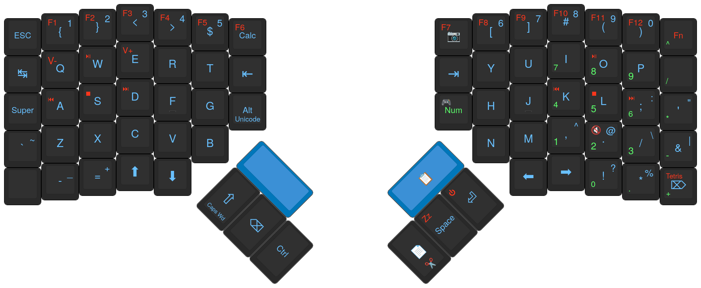

# My fork of ZSA's fork of QMK Firmware

The main branch, firmware25 contains my current config for my Moonlander.

Features include:

- A personalized layout (obviously).
- Tetris mode.
- Various 8-bit songs and sound effects.
- Minor fixes to ZSA's fork (lmao).
- Custom animations with matrix screensaver (or key-saver I guess).
- Eager tapdance behaviour.
- Trial key overrides for programming, inspired by DVORAK programmer:

